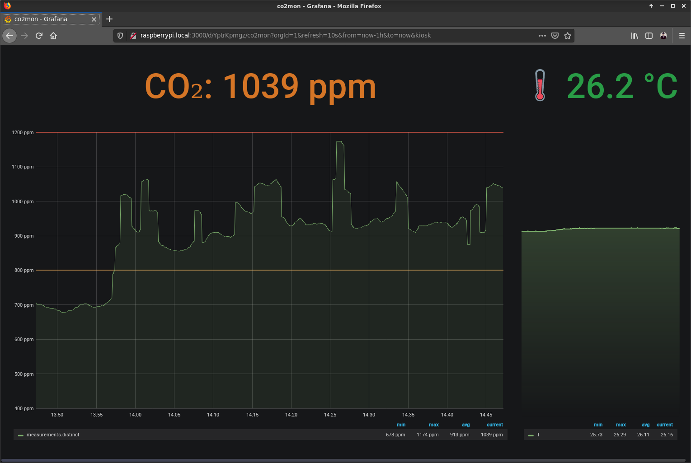

<p align="center"></p>

<p align="center">(temporary logo)</p>

# 🜁 Luft

_Air Quality Monitoring and Reporting_

<!-- vscode extension: Markdown Preview Enhanced; TOC command -->
<!-- @import "[TOC]" {cmd="toc" depthFrom=2 depthTo=6 orderedList=false} -->
<!-- code_chunk_output -->

- [Goals](#goals)
  - [Maybe or Maybe not](#maybe-or-maybe-not)
- [Visuals](#visuals)
  - [Dashboard example (Grafana)](#dashboard-example-grafana)
- [Prerequesites](#prerequesites)
  - [rootfs on SSD via USB](#rootfs-on-ssd-via-usb)
  - [Packages](#packages)
  - [The CO₂ meter/monitor](#the-co2-metermonitor)
  - [OpenSSL](#openssl)
  - [InfluxDB](#influxdb)
  - [Grafana](#grafana)
  - [(maybe) Waveshare e-Paper displays](#maybe-waveshare-e-paper-displays)
- [TODOs](#todos)

<!-- /code_chunk_output -->

## Goals

- [ ] 🖥 Monitor carbon dioxide (CO₂) levels
- [ ] 👀 Show (at least) current data on a connected display
- [ ] 📝 Record data as timeseries
- [ ] 🚪 Make timeseries data accessible

### Maybe or Maybe not

- ☁️ export/sync to remote/"the cloud"
- ⚠️ alert people when value is too high
- 😈 make such alerts audible

## Visuals

### Dashboard example (Grafana)



## Prerequesites

### rootfs on SSD via USB

Follow this guide: <https://www.raspberrypi.org/forums/viewtopic.php?t=44177>

Why? SD cards are not very good for very frequent writes.
Since we want to run the system and also store the timeseries data on the Raspberry Pi, an SSD is highly recommended and preferred.

### Packages

Needed for later steps.

```sh
sudo apt-get update
sudo apt-get install libusb-1.0-0-dev libssl-dev
```

If you do that already now, you can skip the steps below.

Why? At one point some crate will ask for a native ssl implementation, which requires to be compiled from sources.
libusb can be skipped if no e-ink/e-paper display will be used.

### The CO₂ meter/monitor

For this project:

- **TFA Dostmann AirCO2ntrol Mini CO₂-Monitor** (what I've got)
- (aka) CO2Meter<!--d-->.com CO2Mini (model RAD-0301)
- or any clone (there are sometimes differently branded ones online)

Price differences are not that big, so pick any available one.
Sadly the costly part of that is the sensor already, therefore never expect a significant price drop anytime soon.

Product: <https://www.co2meter.com/products/co2mini-co2-indoor-air-quality-monitor>
Manual: <https://co2meters.com/Documentation/Manuals/Manual-RAD-0301.pdf>

For raspbian (debian):

* Install dependencies (co2mon/hidapi works only reliably with statically compiled libusb)

  ```sh
  sudo apt-get update
  sudo apt-get install libusb-1.0-0-dev
  ```

* Add udev rules file `/etc/udev/rules.d/60-co2mon.rules`

  ```txt
  ACTION=="add|change", SUBSYSTEMS=="usb", ATTRS{idVendor}=="04d9", ATTRS{idProduct}=="a052", MODE:="0666"
  ```

  You can verify if the vendor and product IDs match with your device via `lsusb`:

  ```txt
  Bus 001 Device 004: ID 04d9:a052 Holtek Semiconductor, Inc. USB-zyTemp
  […]
  ```

* Reload and trigger

  ```sh
  udevadm control --reload
  udevadm trigger
  ```

### OpenSSL

Some crates' dependencies come with openssl-sys as a depencency, so it needs to be able to compile it on the system.

In our case here it's because of `reqwest` (the underlying HTTP client for the influxdb client)

If not done yet:

```sh
sudo apt-get install libssl-dev
```

### InfluxDB

Guide: <https://pimylifeup.com/raspberry-pi-influxdb/>

```sh
wget -qO- https://repos.influxdata.com/influxdb.key | sudo apt-key add -
echo "deb https://repos.influxdata.com/debian buster stable" | sudo tee /etc/apt/sources.list.d/influxdb.list
sudo apt update
sudo apt install influxdb
sudo systemctl unmask influxdb
sudo systemctl enable influxdb
sudo systemctl start influxdb
```

### Grafana

This frontend is still much better than the influx chronograph.
The new `flux` stuff was not tested yet, maybe it's an option for the future.

In the end you can swap this with any dashboard solution, as long as it can easily ingest influxdb data.

Guide: <http://blog.centurio.net/2018/10/28/howto-install-influxdb-and-grafana-on-a-raspberry-pi-3/>
Download: <https://grafana.com/grafana/download/6.5.2?platform=arm>

```sh
sudo apt-get install -y adduser libfontconfig1
wget https://dl.grafana.com/oss/release/grafana_6.5.2_armhf.deb
sudo dpkg -i grafana_6.5.2_armhf.deb
sudo systemctl daemon-reload
sudo systemctl enable grafana-server
sudo systemctl start grafana-server

# http://<ip-of-grafana-machine>:3000 - admin/admin
# change password after first login!
```

### (maybe) Waveshare e-Paper displays

* Enable SPI support: run `sudo raspi-config` and enable it
  (this will modify the `/boot/config.txt` for you)
  Check, if your user is also member of the group `spi`;
  if not run `sudo adduser <username> spi`

* Use `https://github.com/asaaki/epd-waveshare`, branch: `epd7in5_v2`, if you have also a **version 2** 7.5" display,
  otherwise the regular crate `epd-waveshare` will do fine.

## TODOs

- [ ] Turn setup into a semi or fully automated script
- [ ] Build a case for the components
- [ ] Deploy at work
- [ ] Impress coworkers

-----

🚏
